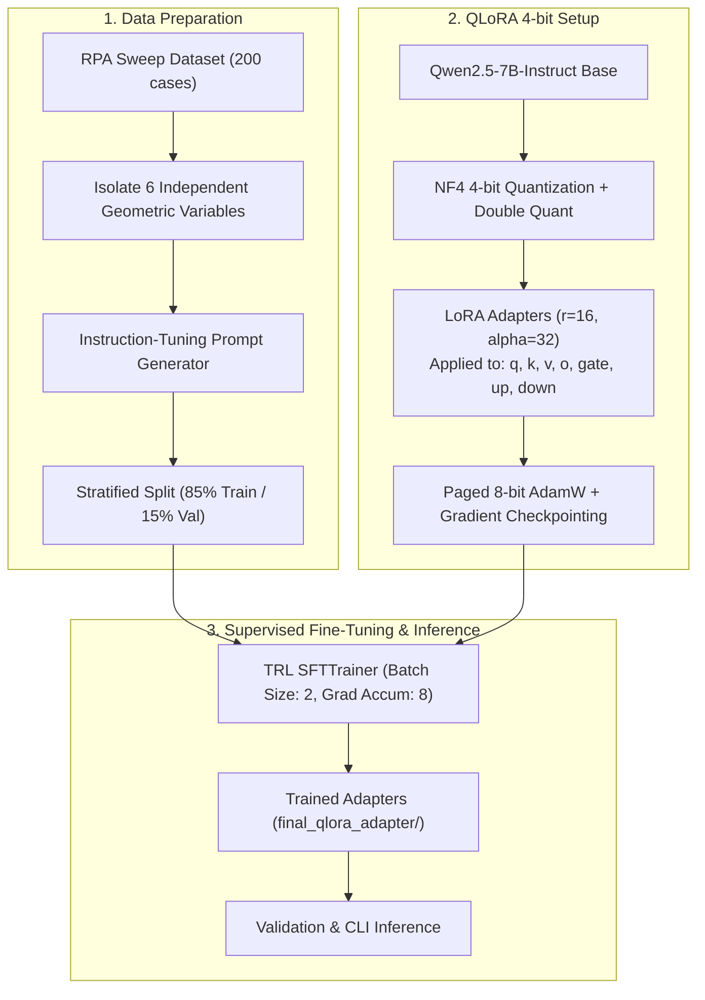

# 🚀 Rocket Engine Cooling Channel Pre-Screening with QLoRA

[](https://github.com/Konakanchi-03/rocket-cooling-channel-qlora)
[](https://python.org)
[](https://pytorch.org)
[](https://huggingface.co/Qwen/Qwen2.5-7B-Instruct)
[-blueviolet)](https://github.com/huggingface/peft)
[-76B900?logo=nvidia&logoColor=white)](https://nvidia.com)
[](LICENSE)

A hands-on project exploring **QLoRA (Quantized Low-Rank Adaptation)** by fine-tuning **Qwen2.5-7B-Instruct** on a local machine (RTX 5060 Ti 16 GB). 

The goal of this project was to learn how to set up, train, and evaluate a local 4-bit quantized LLM, testing whether it can act as a lightweight pre-screening surrogate for rocket engine cooling channels to predict thermal and power constraint pass/fail states.

---

## 📌 Interactive CLI Preview

```bash
$ python inference.py \
    --tw_inner 1.20 \
    --a_min 1.50 \
    --b_rib 2.00 \
    --ar_chamber 1.00 \
    --ar_throat 5.50 \
    --ar_exit 0.65
```

```text
============================================================
INPUT CANDIDATE GEOMETRY:
  tw_inner:     1.2000 mm   (Hot-gas wall thickness)
  a_min_throat: 1.5000 mm   (Nominal throat channel width)
  b_rib:        2.0000 mm   (Throat rib / land width)
  AR_chamber:   1.0000      (Chamber aspect ratio)
  AR_throat:    5.5000      (Throat aspect ratio)
  AR_exit:      0.6500      (Exit aspect ratio)
============================================================

MODEL PRE-SCREENING RESULT:
VERDICT: PASS
- Material Constraint: PASS (Max hot-gas wall temperature Twg = 561.24 K <= 700.0 K limit)
- Power Constraint: PASS (Coolant outlet temperature Tc_out = 237.49 K >= 210.0 K limit; Delta_P = 2.03 bar)
============================================================
```

---

## 🎯 Engineering Motivation & Background

In expander-cycle liquid rocket thrust chambers, regenerative cooling channels must balance two primary constraints:

1. **Material Survivability (Thermal Constraint):**
   The inner liner hot-gas wall temperature must stay below the structural limit of copper alloys (e.g., GrCop-42):
   `T_wg,max <= 700.0 K`

2. **Turbomachinery Power Balance (Expander Cycle Constraint):**
   In an expander cycle, coolant picks up heat through the chamber jacket before driving the turbopump turbine. To maintain cycle balance:
   `T_c,out >= 210.0 K`

While evaluating a single cooling configuration in 1D/2D tools (like RPA — *Rocket Propulsion Analysis*) only takes a few seconds, the key idea is integrating this LLM pre-screening step into an automated ANSYS Fluent simulation workflow to instantly pre-filter candidates before running 3D mesh generation and CFD solves.

---

## Parameter Reduction

In a contoured rocket nozzle, geometry at different stations is coupled:
- The throat circumference is geometrically fixed: `C_throat = pi * D_throat ≈ 409.22 mm`.
- An integer number of channels must fit around the throat perimeter:
  `N_channels = floor(C_throat / (a_min,nom + b_rib))`
- Once `N_channels` is set at the throat, it is fixed along the chamber and nozzle.
- Channel widths at the chamber (`a_1`) and exit (`a_2`) are derived from the local circumference `C(x)`:
  `a(x) = C(x) / N_channels - b_rib`
- Heights are calculated from aspect ratios: `h(x) = a(x) * AR(x)`.

To avoid multicollinearity and prevent the model from learning redundant geometric shortcuts, the inputs are reduced to **6 independent variables**:

| Variable | Design Range | Role in Heat Transfer |
| :--- | :---: | :--- |
| `tw_inner_mm` | 0.50 - 3.00 mm | Conduction wall resistance: `Delta T = q * (t_w / k)`. Strongly drives hot-gas wall temperature `T_wg`. |
| `a_min_nominal_mm` | 0.80 - 3.00 mm | Throat channel width target; dictates channel count `N_channels`. |
| `b_rib_mm` | 0.80 - 3.00 mm | Throat rib width for fin conduction and channel spacing. |
| `AR_chamber` | 0.50 - 1.50 | Controls flow area and velocity in the chamber region. |
| `AR_throat` | 2.00 - 8.00 | Controls throat channel height, coolant velocity, and convection coefficient `h_c` where heat flux peaks. |
| `AR_exit` | 0.30 - 1.00 | Affects coolant flow velocity and pressure drop across the divergent section. |

*Operating Conditions Held Constant:* Coolant inlet temperature `T_in = 30.0 K`, inlet pressure `P_in = 55.0 bar`, total jacket thickness `t_total = 20.0 mm`.

---

## 🏗️ Pipeline Workflow



---

## 🚀 Quickstart & Usage

### 1. Setup Virtual Environment

```bash
# Clone the repository
git clone https://github.com/Konakanchi-03/rocket-cooling-channel-qlora.git
cd rocket-cooling-channel-qlora

# Create Python 3.11 virtual environment
python3.11 -m venv venv
source venv/bin/activate  # On Windows: .\venv\Scripts\activate

# Install PyTorch with CUDA support
pip install torch torchvision --index-url https://download.pytorch.org/whl/cu130

# Install dependencies
pip install transformers peft bitsandbytes datasets accelerate trl
```

### 2. Run Interactive CLI Inference
Test a cooling channel geometry candidate:

```bash
python inference.py \
  --tw_inner 1.00 \
  --a_min 1.20 \
  --b_rib 1.50 \
  --ar_chamber 1.10 \
  --ar_throat 6.00 \
  --ar_exit 0.70
```

### 3. Run Validation Evaluation
Run predictions across the validation split:

```bash
python evaluate_validation.py
```
*Outputs are saved to `eval_results.json` and `benchmark_metrics.json`.*

### 4. Train with QLoRA
Run the fine-tuning script:

```bash
python train_qlora.py
```

---

## 📂 Repository Organization

```text
├── README.md                 # Project overview and notes
├── WALKTHROUGH.md            # Technical walkthrough of the pipeline
├── inference.py              # CLI inference script
├── train_qlora.py            # QLoRA fine-tuning script
├── evaluate_validation.py    # Validation split evaluation script
├── rpa_llm_dataset.csv       # RPA simulation dataset (200 samples)
├── geometry_samples_200.csv  # Geometric sample configurations
├── train.jsonl               # Stratified training split (170 samples)
├── val.jsonl                 # Stratified validation split (30 samples)
├── final_qlora_adapter/      # Trained LoRA adapter weights and tokenizer configuration
│   ├── adapter_model.safetensors
│   ├── adapter_config.json
│   ├── tokenizer.json
│   └── special_tokens_map.json
├── eval_results.json         # Raw validation predictions vs. ground truth
├── benchmark_metrics.json    # Evaluation metrics
└── nvidia_smi.log            # Recorded GPU telemetry log during training
```

---

## 📝 Project Context & Next Steps

This project was built as a hands-on learning project to gain practical experience with **QLoRA** and local LLM fine-tuning, exploring whether a quantized open-source LLM can learn structured engineering output schemas and basic design constraint relationships from simulation data.

- **Part of a Broader Design & Simulation Workflow:** This pre-screening model is designed as a module within a larger automated design and simulation pipeline, serving as an initial filter before triggering automated ANSYS Fluent CFD runs and detailed conjugate heat transfer simulations.
- **Expanding Dataset Size (Work in Progress):** The current model was trained on an initial set of 200 simulation points. Generating a larger, more comprehensive dataset is currently work in progress to test how data scaling influences model reliability and accuracy.
- **Further Exploration:** Exploring different prompt structures, training parameters, and hybrid approaches to better capture continuous physical boundaries.

---

## 📜 License
This project is licensed under the **MIT License**. Free for academic, educational, and personal research use.
