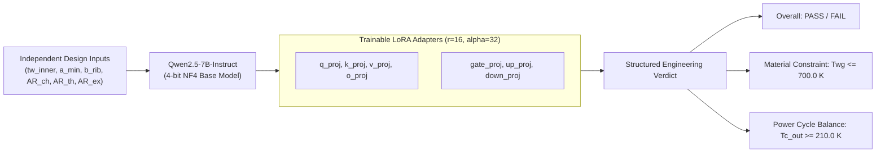

# Rocket Engine Cooling Channel Pre-Screening with QLoRA

[](https://python.org)
[](https://pytorch.org)
[](https://huggingface.co)
[-blueviolet)](https://github.com/huggingface/peft)
[-76B900?logo=nvidia&logoColor=white)](https://nvidia.com)

An end-to-end Machine Learning pipeline that fine-tunes **Qwen2.5-7B-Instruct** using **QLoRA** on a local 16GB GPU to serve as an instantaneous pre-screening surrogate for rocket engine regenerative cooling channel geometries, predicting thermal and power constraint satisfaction before executing computationally expensive Conjugate Heat Transfer (CHT) CFD or RPA simulations.

---

## Architecture & Workflow



---

## Highlights & Engineering Rationale

1. **Physics-Informed Parameter Reduction**:
   - In rocket nozzle cooling jackets, channel count $N$ and per-station dimensions ($a_{chamber}$, $a_{exit}$, $h_{station}$) are mathematically constrained by the throat dimensions and nozzle contour.
   - We reduced 16 collinear geometric variables down to the **6 true independent design inputs** (`tw_inner_mm`, `a_min_nominal_mm`, `b_rib_mm`, `AR_chamber`, `AR_throat`, `AR_exit`), preventing the model from exploiting spurious geometric shortcuts.

2. **Structured Diagnostic Output**:
   - Instead of a naive binary classification ($0$ or $1$), the model generates a structured diagnostic report detailing:
     - Overall Verdict (`PASS` / `FAIL`)
     - Material constraint check against $T_{wg,max} \le 700.0\text{ K}$ (CuCrZr hot-wall limit)
     - Expander cycle power balance check against $T_{c,out} \ge 210.0\text{ K}$ and $\Delta P$

3. **Memory & Hardware Optimization**:
   - Quantized the 7B base model to **4-bit NF4** with Double Quantization.
   - Trained with **Paged 8-bit AdamW**, gradient checkpointing, and gradient accumulation on a single **NVIDIA GeForce RTX 5060 Ti (16 GB VRAM)**.
   - Peak VRAM consumption: **9.30 GB** (leaving **6.7 GB headroom**, 0 OOM errors).

---

## Hardware & Telemetry

| Metric | Measured Specification |
| :--- | :--- |
| **GPU** | NVIDIA GeForce RTX 5060 Ti (16,311 MiB VRAM) |
| **CUDA Compute Capability** | `sm_120` (Blackwell Architecture), CUDA 13.0 |
| **Base Model VRAM (4-bit NF4)** | 5.18 GB |
| **Peak Training VRAM** | 9.30 GB |
| **Trainable Parameters** | 40,370,176 / 7,655,986,688 (0.53%) |
| **Training Duration** | 5.30 minutes (33 optimization steps, 3 epochs) |

Live GPU utilization, temperature, and memory consumption were logged every 5 seconds to [`nvidia_smi.log`](nvidia_smi.log).

---

## Training Dynamics & Loss Curve

```
Step   1 | Epoch 0.09 | Training Loss: 2.9031
Step   4 | Epoch 0.38 | Training Loss: 2.3135
Step   8 | Epoch 0.75 | Training Loss: 0.8880
Step  10 | Epoch 0.94 | Training Loss: 0.5024 | Eval Loss: 0.3655
Step  16 | Epoch 1.47 | Training Loss: 0.2816
Step  20 | Epoch 1.85 | Training Loss: 0.2671 | Eval Loss: 0.2686
Step  30 | Epoch 2.75 | Training Loss: 0.2606 | Eval Loss: 0.2646
Step  33 | Epoch 3.00 | Training Loss: 0.2607 | Eval Loss: 0.2642
```

---

## Quickstart & Usage

### 1. Installation

```bash
# Clone the repository
git clone https://github.com/your-username/rocket-qlora-screening.git
cd rocket-qlora-screening

# Create and activate virtual environment (Python 3.11 recommended)
python3.11 -m venv venv
source venv/bin/activate

# Install PyTorch with CUDA 13.0 support
pip install torch torchvision --index-url https://download.pytorch.org/whl/cu130

# Install dependencies
pip install transformers peft bitsandbytes datasets accelerate trl
```

### 2. Run Inference on a Custom Design

Use the standalone CLI to test any cooling channel geometry:

```bash
python inference.py \
  --tw_inner 1.20 \
  --a_min 1.50 \
  --b_rib 2.00 \
  --ar_chamber 1.00 \
  --ar_throat 5.50 \
  --ar_exit 0.65
```

**Example Output:**
```text
============================================================
INPUT CANDIDATE GEOMETRY:
  tw_inner:     1.2000 mm
  a_min_throat: 1.5000 mm
  b_rib:        2.0000 mm
  AR_chamber:   1.0000
  AR_throat:    5.5000
  AR_exit:      0.6500
============================================================

MODEL PRE-SCREENING RESULT:
VERDICT: PASS
- Material Constraint: PASS (Max hot-gas wall temperature Twg = 561.24 K <= 700.0 K limit)
- Power Constraint: PASS (Coolant outlet temperature Tc_out = 237.49 K >= 210.0 K limit; Delta_P = 2.03 bar)
============================================================
```

### 3. Evaluate Validation Benchmark

Run full validation evaluation across held-out test samples:

```bash
python evaluate_validation.py
```

### 4. Re-train from Scratch

```bash
# Prepare dataset splits
python scratch/format_dataset.py

# Launch training pipeline
python train_qlora.py
```

---

## Repository Structure

```
├── README.md                 # Project overview and portfolio presentation
├── WALKTHROUGH.md            # In-depth technical tutorial and physics breakdown
├── inference.py              # Interactive CLI inference script
├── train_qlora.py            # End-to-end QLoRA training script with GPU telemetry
├── evaluate_validation.py    # Quantitative benchmark evaluation script
├── rpa_llm_dataset.csv       # Full simulation dataset with CFD/RPA labels
├── geometry_samples_200.csv  # Reference geometric sample matrix
├── train.jsonl               # Formatted stratified training split (170 samples)
├── val.jsonl                 # Formatted stratified validation split (30 samples)
├── final_qlora_adapter/      # Trained LoRA adapter weights and tokenizer config
│   ├── adapter_model.safetensors
│   ├── adapter_config.json
│   └── tokenizer.json
├── eval_results.json         # Raw validation sample predictions vs. ground truth
├── benchmark_metrics.json    # Precision, recall, and confusion matrix results
└── nvidia_smi.log            # Recorded GPU utilization and VRAM telemetry
```

---

## Detailed Technical Guide
For a deep dive into the underlying thermodynamic physics, Fourier wall conduction, expander cycle enthalpy requirements, and QLoRA mathematical derivation, refer to [**WALKTHROUGH.md**](WALKTHROUGH.md).

---

## License
MIT License. Free for academic, educational, and research use.
