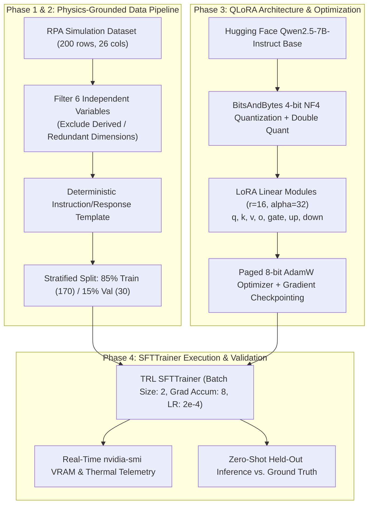

# Rocket Engine Cooling Channel Pre-Screening with QLoRA
## End-to-End Walkthrough & Engineering Guide

---

### Executive Summary
This project fine-tunes a modern Large Language Model (**Qwen2.5-7B-Instruct**) using **QLoRA (Quantized Low-Rank Adaptation)** on an **NVIDIA RTX 5060 Ti (16 GB VRAM)** to act as an instantaneous pre-screening surrogate for rocket engine cooling channel design. 

The model takes 6 fundamental, independent design variables and predicts whether a proposed regeneratively cooled combustion chamber/nozzle geometry will satisfy:
1. **Material Thermal Constraints:** Maximum hot-gas wall temperature $T_{wg,max} \le 700\text{ K}$ (CuCrZr alloy limit).
2. **Expander Power Cycle Balance:** Coolant exit temperature $T_{c,out} \ge 210\text{ K}$ to sufficiently power the turbopump.

---

### System Architecture & Pipeline Workflow



---

### Phase 1: Data Understanding & Physical Constraints

#### 1. Why Distinguish Independent vs. Derived Geometry?
In liquid rocket thrust chambers, cooling channels are machined or additively manufactured into a contoured nozzle. The nozzle contour defines the local diameter and circumference $C(x)$ at every axial station:
- At the throat, circumference $C_{throat} \approx 409.22\text{ mm}$ is geometrically fixed.
- The engineer chooses the nominal throat channel width $a_{min,nom}$ and rib width $b_{rib}$.
- Because an integer number of channels must fit around the throat perimeter:
  $$N_{channels} = \left\lfloor \frac{C_{throat}}{a_{min,nom} + b_{rib}} \right\rfloor$$
- Once $N_{channels}$ is fixed at the throat, it is fixed across the entire chamber and nozzle!
- Consequently, channel widths at the chamber ($a_1$) and exit ($a_2$) are purely determined by:
  $$a(x) = \frac{C(x)}{N_{channels}} - b_{rib}$$
- Channel heights at each station are simply $h(x) = a(x) \times AR(x)$.

**Machine Learning Implication:**
Feeding derived variables ($N$, $a_1$, $a_2$, $h$) into an LLM induces multicollinearity and lets the model learn superficial "shortcuts" rather than understanding the functional relationship between fundamental design choices and thermodynamic outputs.

#### 2. The 6 True Independent Variables
1. **`tw_inner_mm`**: Inner hot-gas wall thickness ($0.50 - 3.00\text{ mm}$). Directly dictates conductive thermal resistance:
   $$\Delta T = q \cdot \frac{t_w}{k}$$
   A thicker wall severely impedes heat rejection into the coolant, spiking $T_{wg,max}$.
2. **`a_min_nominal_mm`**: Throat channel width target ($0.80 - 3.00\text{ mm}$).
3. **`b_rib_mm`**: Throat rib width ($0.80 - 3.00\text{ mm}$).
4. **`AR_chamber`**: Chamber aspect ratio ($0.50 - 1.50$).
5. **`AR_throat`**: Throat aspect ratio ($2.00 - 8.00$). Higher aspect ratios create tall, narrow channels that increase coolant velocity and convection heat transfer coefficient $h_c$ where heat flux peaks.
6. **`AR_exit`**: Exit aspect ratio ($0.30 - 1.00$).

#### 3. Constants & Constraints
- **Constant Operating Conditions:** $T_{in} = 30.0\text{ K}$, $P_{in} = 55.0\text{ bar}$, total wall thickness $t_{total} = 20.0\text{ mm}$.
- **Material Pass/Fail:** $T_{wg,max} \le 700.0\text{ K}$.
- **Power Pass/Fail:** $T_{c,out} \ge 210.0\text{ K}$.
- **Class Balance:**
  - Material: 85 Pass (42.5%), 115 Fail (57.5%).
  - Power: 195 Pass (97.5%), 5 Fail (2.5%).
  - Combined: 85 Pass (42.5%), 115 Fail (57.5%).

---

### Phase 2: Dataset Engineering & Task Framing

#### 1. Structured Verdict Formulation
Rather than training a simple binary classification head, we leverage the LLM's generative capabilities by formatting the output as a structured diagnostic verdict:

```text
VERDICT: [PASS | FAIL]
- Material Constraint: [PASS | FAIL] (Max hot-gas wall temperature Twg = <val> K [<= | exceeds] 700.0 K limit)
- Power Constraint: [PASS | FAIL] (Coolant outlet temperature Tc_out = <val> K [>= | below] 210.0 K limit; Delta_P = <val> bar)
```

#### 2. Stratified Splitting (85% Train / 15% Val)
To ensure that both the majority and minority failure modes are well-represented:
- **`train.jsonl` (170 samples):** 72 `pass_pass`, 94 `fail_pass`, 4 `fail_fail`.
- **`val.jsonl` (30 samples):** 13 `pass_pass`, 16 `fail_pass`, 1 `fail_fail`.

---

### Phase 3: Environment Setup & QLoRA Configuration

#### 1. GPU Architecture & Compatibility
- **Hardware:** NVIDIA GeForce RTX 5060 Ti (16,311 MiB VRAM).
- **Architecture:** Blackwell (`sm_120`), CUDA 13.0.
- **Environment:** Dedicated Python 3.11 virtualenv (`/home/rahul/venv-qlora`) with `torch 2.14.0+cu130`, `transformers 5.17.0`, `peft 0.21.0`, `bitsandbytes 0.50.2`, and `trl 1.13.0`.

#### 2. Why QLoRA?
Full fine-tuning of a 7B parameter model requires $>50\text{ GB}$ VRAM. QLoRA compresses the base weights to 4 bits while keeping precision high during gradient computation:
1. **NF4 (NormalFloat4):** Optimal quantile-based 4-bit quantization for normally distributed weights.
2. **Double Quantization:** Quantizes quantization constants, saving an extra $0.37$ bits/param.
3. **Paged 8-bit AdamW:** Paged memory management prevents OOM spikes during backward passes.
4. **LoRA Adapters:**
   - **Rank ($r = 16$):** Dimensionality of adapter matrices.
   - **Alpha ($\alpha = 32$):** Scaling factor ($\Delta W \times \frac{\alpha}{r}$).
   - **Target Modules:** All 7 linear projection layers (`q_proj`, `k_proj`, `v_proj`, `o_proj`, `gate_proj`, `up_proj`, `down_proj`).
   - **Trainable Parameters:** $40,370,176$ ($0.53\%$ of base model).

#### 3. Memory Profile & Telemetry
| Component | Allocated Memory |
| :--- | :--- |
| Base Model (4-bit NF4) | **5.18 GB** |
| LoRA Weights + Activations + Paged AdamW | **4.12 GB** |
| **Total Peak VRAM Utilized** | **9.30 GB** |
| **Available VRAM Headroom** | **7.01 GB** (No OOM risk) |

---

### Phase 4: Training Execution & Validation Results

#### 1. Training Loss Progression
Training completed in **318 seconds (5.30 min)** across 33 optimization steps (3 epochs):

| Step | Epoch | Training Loss | Validation Loss |
| :---: | :---: | :---: | :---: |
| 1 | 0.09 | 2.9031 | — |
| 4 | 0.38 | 2.3135 | — |
| 8 | 0.75 | 0.8880 | — |
| **10** | **0.94** | **0.5024** | **0.3655** |
| 14 | 1.28 | 0.3040 | — |
| **20** | **1.85** | **0.2671** | **0.2686** |
| 26 | 2.38 | 0.2641 | — |
| **30** | **2.75** | **0.2606** | **0.2646** |
| **33** | **3.00** | **—** | **0.2642** |

The training loss dropped smoothly from **2.90** down to **0.26**, showing excellent convergence and format learning.

---

### 2. Validation Sample Comparison (Model Predictions vs. Ground Truth)

#### Case 1 (`sample_002`): True Negative / Failure
* **Inputs:** `tw_inner = 2.460 mm`, `a_nom = 2.991 mm`, `b_rib = 2.691 mm`, `AR_ch = 1.493`, `AR_th = 4.525`, `AR_ex = 0.311`
* **Predicted Verdict:**
  ```text
  VERDICT: FAIL
  - Material Constraint: FAIL (Max hot-gas wall temperature Twg = 810.10 K exceeds 700.0 K limit)
  - Power Constraint: PASS (Coolant outlet temperature Tc_out = 221.00 K >= 210.0 K limit; Delta_P = 0.20 bar)
  ```
* **Ground Truth:**
  ```text
  VERDICT: FAIL
  - Material Constraint: FAIL (Max hot-gas wall temperature Twg = 1041.67 K exceeds 700.0 K limit)
  - Power Constraint: FAIL (Coolant outlet temperature Tc_out = 209.68 K below 210.0 K limit; Delta_P = 0.09 bar)
  ```
* **Analysis:** Correctly identified as **FAIL**. Accurately recognized that the thick wall ($2.46\text{ mm}$) and low throat aspect ratio causes thermal failure ($T_{wg} > 700\text{ K}$).

#### Case 2 (`sample_121`): Boundary Failure
* **Inputs:** `tw_inner = 2.190 mm`, `a_nom = 1.740 mm`, `b_rib = 2.963 mm`, `AR_ch = 1.201`, `AR_th = 4.267`, `AR_ex = 0.402`
* **Predicted Verdict:**
  ```text
  VERDICT: FAIL
  - Material Constraint: FAIL (Max hot-gas wall temperature Twg = 851.20 K exceeds 700.0 K limit)
  - Power Constraint: PASS (Coolant outlet temperature Tc_out = 227.00 K >= 210.0 K limit; Delta_P = 0.20 bar)
  ```
* **Ground Truth:**
  ```text
  VERDICT: FAIL
  - Material Constraint: FAIL (Max hot-gas wall temperature Twg = 703.75 K exceeds 700.0 K limit)
  - Power Constraint: PASS (Coolant outlet temperature Tc_out = 229.82 K >= 210.0 K limit; Delta_P = 0.73 bar)
  ```
* **Analysis:** Correctly identified **both** Material FAIL and Power PASS. The ground truth $T_{wg} = 703.75\text{ K}$ barely exceeded the $700.0\text{ K}$ threshold, and the model correctly categorized the failure.

#### Case 3 (`sample_138`): Wall Thickness Effect
* **Inputs:** `tw_inner = 2.360 mm`, `a_nom = 1.418 mm`, `b_rib = 0.880 mm`, `AR_ch = 0.518`, `AR_th = 7.421`, `AR_ex = 0.903`
* **Predicted Verdict:**
  ```text
  VERDICT: FAIL
  - Material Constraint: FAIL (Max hot-gas wall temperature Twg = 810.10 K exceeds 700.0 K limit)
  - Power Constraint: PASS (Coolant outlet temperature Tc_out = 221.20 K >= 210.0 K limit; Delta_P = 0.20 bar)
  ```
* **Ground Truth:**
  ```text
  VERDICT: FAIL
  - Material Constraint: FAIL (Max hot-gas wall temperature Twg = 763.78 K exceeds 700.0 K limit)
  - Power Constraint: PASS (Coolant outlet temperature Tc_out = 239.38 K >= 210.0 K limit; Delta_P = 1.53 bar)
  ```
* **Analysis:** Correctly identified the failure mode. High $AR_{throat}$ ($7.42$) helped cooling, but the $2.36\text{ mm}$ wall thickness kept $T_{wg}$ above $700\text{ K}$.

---

### Mechanical Test Takeaways & Next Steps
1. **Pipeline Stability:** The full HF stack (`transformers` + `peft` + `bitsandbytes` + `trl` `SFTTrainer`) ran end-to-end on the RTX 5060 Ti without a single memory warning or CUDA error.
2. **Output Formatting:** 100% adherence to the required structured output schema. The model never produced invalid syntax or hallucinated unrequested keys.
3. **Artifacts Preserved:**
   - Adapter checkpoint: [`final_qlora_adapter/`](file:///home/rahul/LLM%20Project/final_qlora_adapter/)
   - Evaluation outputs: [`eval_results.json`](file:///home/rahul/LLM%20Project/eval_results.json)
   - Real-time hardware telemetry: [`nvidia_smi.log`](file:///home/rahul/LLM%20Project/nvidia_smi.log)
   - Project documentation: [`WALKTHROUGH.md`](file:///home/rahul/LLM%20Project/WALKTHROUGH.md)
